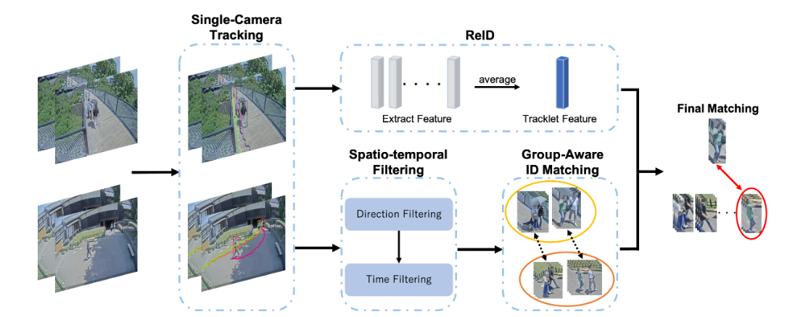

# Multi-Camera People Tracking with Spatio-Temporal and Group Considerations

> paper:[Multi-Camera People Tracking with Spatio-Temporal and Group Considerations](https://ieeexplore.ieee.org/abstract/document/10458119)
> 
> S. Sakaguchi, M. Amagasaki, M. Kiyama, AND T. Okamoto13

## Abstract
Multi-camera people tracking (MCPT) has become increasingly relevant in recent years as the demand for accurate people-tracking systems has increased along with the growing number of surveillance cameras. There are challenges that MCPT must overcome, such as changes in a person’s appearance due to illumination and changes in viewpoint and posture between cameras. Additionally, occlusion is likely to occur in crowded places like tourist spots, making it even more difficult to perform accurate tracking based on a person’s appearance. To address these problems, we propose an MCPT system that uses additional spatio-temporal and group information. First, the system uses spatio-temporal filtering to remove candidates that are considered irrelevant. Then, group-aware matching is used to correct ID matching errors based solely on the features of an individual’s appearance. In this paper, we evaluate this system on data collected from surveillance cameras at Kumamoto Castle, a tourist spot designated as a National Important Cultural Property. This dataset contains images of people in a wide age range and with various degrees of crowding. We demonstrate that our system is effective in scenarios with large crowds, and that the additional contextual information is helpful when it is difficult to track based on a person’s appearance alone.
<p align="center"></p>

## Installation

1. Run `git clone https://github.com/amagasaki-lab/STaG-MCPT.git`
2. Install required packages `pip install -r requirements.txt`


## Data Preparation

Please place the video you want to track in the `/data/movie` directory with the following structure:
```
data
   |——————movie
   |        └——————cameraA
   |        └——————cameraB
   |        └——————cameraC
   |        └——————...
   |        
   └——————...
           
```

## 1. Single-Camera Tracking
Feel free to choose the MOT model used for Single-Camera Tracking. In this paper, [ByteTrack](https://github.com/ifzhang/ByteTrack) is used.
Place the output txt file in the `/data/single_camera_tracking` directory.

## 2. Extract Features
As a preliminary step, rewrite the following file for your own use and run it．
The output is npy files `<id>, <frame>, <image>, <bbox_left>, <bbox_top>` containing the image at each frame.
```
bash scripts/img2npy.sh
```
The output will be in the `/data/image` directory.

Next, run the ReID model. In this paper, MGN is used, but you are free to use your own ReID model.
When using MGN, either download the [pretrained weights](https://github.com/GNAYUOHZ/ReID-MGN) or train the model on your own dataset, then rewrite the following file and run it.
The output is npy files `<tracklet_feature>, <tracklet_id>, <tracklet_frame>, <tracklet_dir>` containing the features of each tracklet.
```
bash scripts/ReID.sh
```
The output will be in the `/output/features` directory.

## 3. Multi-Camera Tracking
1. Group formation
First, Calculate the distance for each tracklet. Rewrite the following file and run it．
```
bash scripts/calc_distance.sh
```
The output will be in the `/output/distances` directory.

Next, form a group. Rewrite the following file and execute it.
The output is txt files `<frame>, <id>, <group>,<bbox_left>, <bbox_top>, <bbox_width>, <bbox_height>, <conf>, <x>, <y>, <z>` containing the features of each tracklet.
```
bash scripts/grouping.sh
```
The output will be in the `/output/grouping` directory.

2. matching
Matching is performed between the two cameras. Rewrite the following file and run it．
```
bash scripts/group_co-traveler.sh
```
The output will be in the `/output/result` directory.

## NOTE
The code we have released is optimized for a private dataset that we used. Therefore, you may need to modify some values in the Python files to suit your own dataset.
1. Spatio-temporal parameter settings
The direction and time hyperparameters used in this paper need to be set to different values depending on the dataset. Therefore, please change the values in the following files to match the dataset you are using.
- `matching/filtering.py`:Please change the travel time in `filtering_info`, and change the camera positions in `filtering_group_process`.
- `matching/calc_distance.py`:Please change direction of pedestrian movement in `calc_angle`.
- `ReID/extract_feature/extract_tracklet_feature.py`:Please change direction of pedestrian movement in `dir_information`.

2. Time synchronization between cameras
If the fps differs between cameras, the frames must be adjusted and synchronized. Therefore, please change the values in the following files to match the dataset you are using.
- `ReID/extract_feature/extract_tracklet_feature.py`:Please change the travel time in `filtering_info`, and change the camera positions in `filtering_group_process`.


## Citation

```text
@ARTICLE{2024SakaguchiSTaG,
    author = {Sakaguchi, Shoki and Amagasaki, Motoki and Kiyama, Masato and Okamoto, Toshiaki},
    title = "{Multi-Camera People Tracking with Spatio-Temporal and Group Considerations}",
    volume={12},
    journal = {IEEE Access},
    year = 2024,
}
```

## Acknowledgement

A large part of the codes, ideas and results are borrowed from [YOLOX](https://github.com/Megvii-BaseDetection/YOLOX), [ByteTrack](https://github.com/ifzhang/ByteTrack), [MGN](https://github.com/GNAYUOHZ/ReID-MGN), and [CTS](https://ieeexplore.ieee.org/document/8265513). Thanks for their excellent work!
